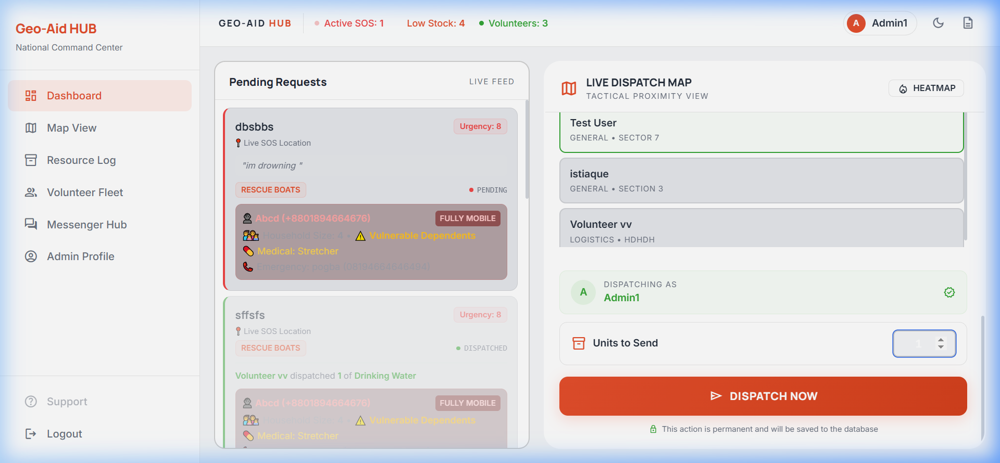
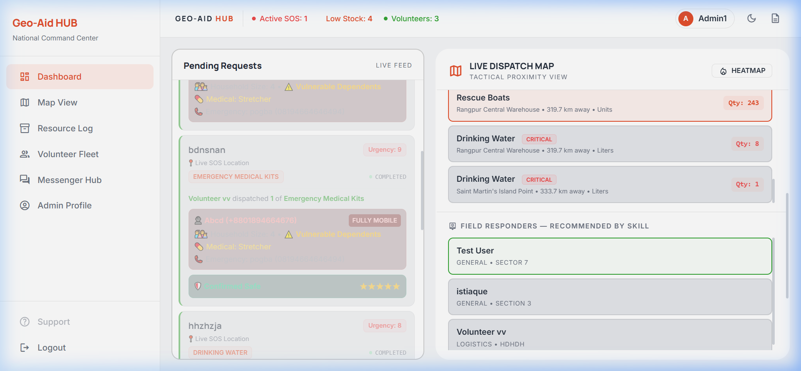
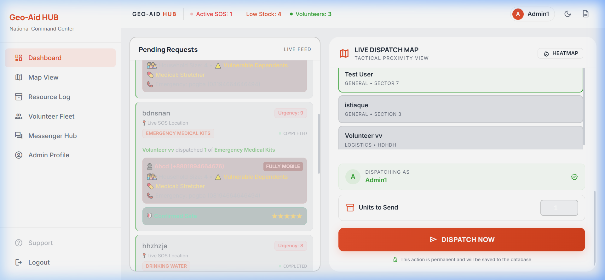
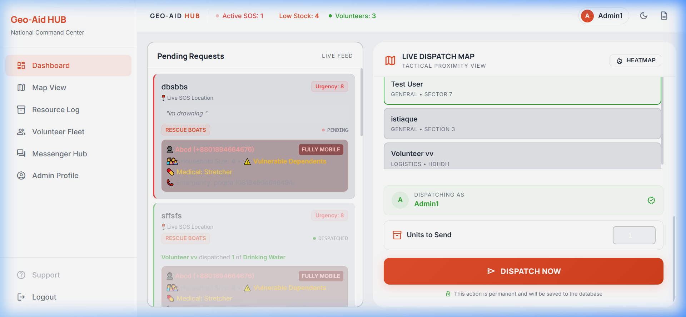
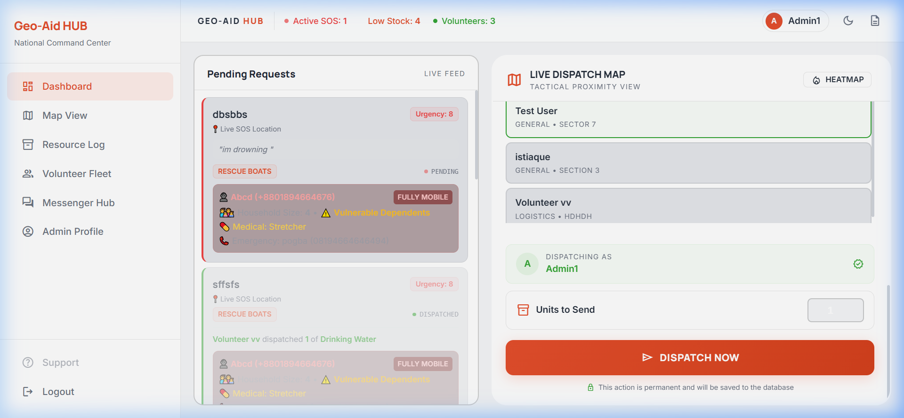
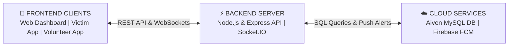
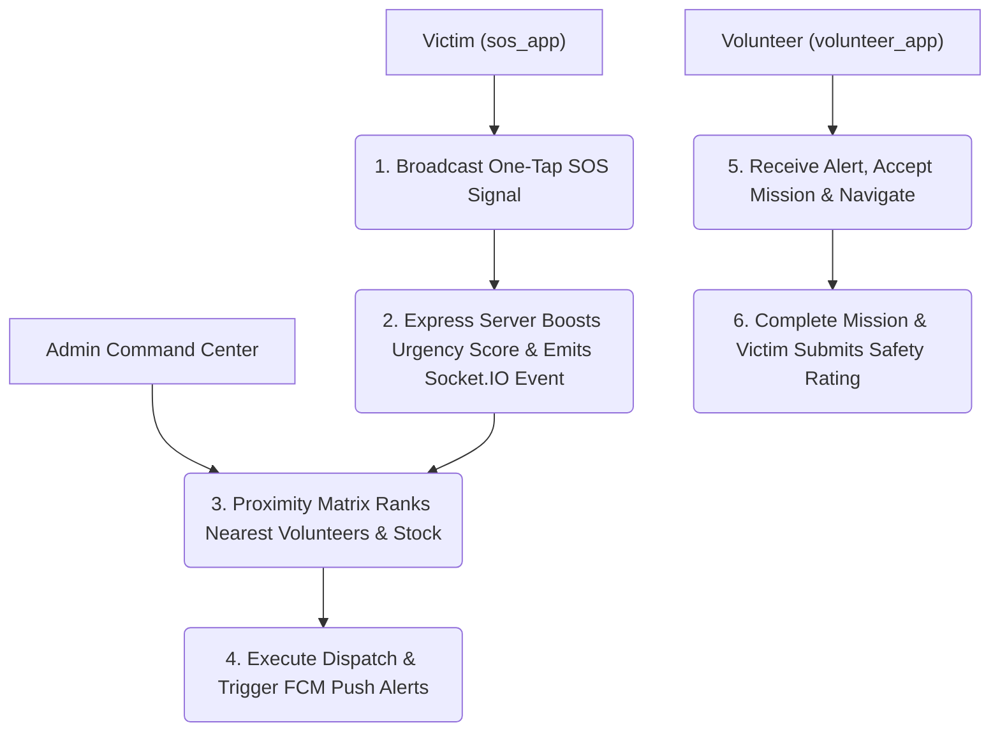

# 🚨 Geo-Aid Hub: Real-Time Disaster Response & Emergency Command Ecosystem

[](https://nodejs.org/)
[](https://expressjs.com/)
[](https://flutter.dev/)
[](https://aiven.io/)
[](https://socket.io/)
[](https://firebase.google.com/)
[](https://geo-aid-hub.onrender.com)
[](LICENSE)

**Geo-Aid Hub** is a multi-platform, real-time emergency response ecosystem designed to streamline disaster relief operations, rescue dispatching, and resource allocation. Developed specifically to address communication and logistical bottlenecks during severe flooding and natural disasters, the platform connects **Distressed Victims**, **Volunteer Responders**, and **Command Center Administrators** into a single synchronized network.

---

## 🌟 Key Features

* **🚨 One-Tap Emergency SOS Broadcasting:** Victims send distress alerts with GPS coordinates, custom urgency levels, household sizes, and specific relief requirements (Medical Kits, Drinking Water, Food Rations, Rescue Boats).
* **📐 Haversine Proximity Dispatch Engine:** Calculates great-circle spatial distances inside SQL queries to automatically recommend the nearest available relief warehouses and qualified volunteer responders.
* **⚖️ Vulnerability-Aware Prioritization:** Automatically boosts distress urgency scores for mobility-impaired victims (*Bedbound*, *Wheelchair*, *Requires Assistance*) or households with infants/elderly members.
* **⚡ Real-Time Socket.IO Synchronisation:** Instant zero-latency streaming of new SOS signals, map marker updates, dispatch state changes, and chat feeds without requiring manual page refreshes.
* **🔔 High-Priority FCM Push Notifications:** Sends instant push alert banners to mobile devices via Firebase Cloud Messaging, waking up victim and volunteer apps even when running in the background.
* **💬 Universal Three-Way Messenger Hub:** Direct 1-on-1 and group chat capabilities supporting **Admin-to-Admin**, **Admin-to-Victim**, and **Admin-to-Volunteer** channels with persistent message history.
* **📄 Client-Side PDF Registry Exports:** Generates instant landscape PDF reports for volunteer fleets, warehouse inventory, and shelter capacities using `jsPDF`.

---

## 📸 System Screenshots & Interface Showcase

### 1. 🖥️ Web Command Center Dashboard
*The central administrative console featuring real-time request tracking, tactical proximity map visualization, and one-click dispatch controls.*



---

### 2. 💬 Universal Command Messenger Hub
*Unified real-time communication portal for direct interactions between Administrators, Field Responders, and Victims.*



---

### 3. 📦 Resource Log & Shelter Status
*Live warehouse inventory tracker with low-stock warnings (< 50 units) and interactive Leaflet.js shelter capacity maps.*



---

### 4. 📱 Victim SOS Mobile Application (`sos_app`)
*Cross-platform Flutter application for victims to configure emergency profiles, broadcast GPS-tagged SOS alerts, track active dispatches, and submit safety feedback.*



---

### 5. 🚑 Volunteer Responder Mobile Application (`volunteer_app`)
*Mobile portal for verified field volunteers to receive mission alerts, view route navigation, update status, and communicate with dispatchers.*



---

## 🏗️ System Architecture & Workflow

### High-Level Architecture Diagram



### Primary Emergency Dispatch Workflow



---

## 📊 Performance & Reliability Evaluation

The production backend hosted on **Render** (connected to **Aiven Cloud MySQL**) was benchmarked using Postman Collection Runner across 10 sequential iterations (40 total HTTP requests):

| Endpoint Route | HTTP Method | Payload Size | Min Latency | Max Latency | Calculated Avg Latency | Reliability Rate |
| :--- | :---: | :---: | :---: | :---: | :---: | :---: |
| `/api/resources` | `GET` | 1.007 KB | 495 ms | 603 ms | **520 ms** | **100% (10/10)** |
| `/api/requests` | `GET` | 1.173 KB | 497 ms | 1,019 ms | **560 ms** | **100% (10/10)** |
| `/api/volunteers` | `GET` | 931 B | 495 ms | 525 ms | **512 ms** | **100% (10/10)** |
| `/api/stats` | `GET` | 514 B | 949 ms | 974 ms | **960 ms** | **100% (10/10)** |

> **Result:** Achieved **100% success rate (40/40 HTTP 200 OK responses)** with zero dropped connections and sub-second average response times.

---

## 🛠️ Tech Stack & Technologies

* **Backend Runtime:** Node.js, Express.js
* **Real-Time Engine:** Socket.IO (WebSockets)
* **Database:** Aiven Cloud Managed MySQL (SSL Encrypted)
* **Push Notifications & Auth:** Firebase Cloud Messaging (FCM), Firebase Auth SDK
* **Web Command Center:** HTML5, CSS3, JavaScript (ES6+), SPA Router, Tailwind CSS, Leaflet.js, jsPDF
* **Mobile Applications:** Flutter SDK, Dart (Android & iOS)
* **Hosting Platforms:** Render (Server API), Aiven (MySQL Cloud)

---

## 🚀 Getting Started & Installation Guide

### Prerequisites
* [Node.js](https://nodejs.org/) (v18.x or higher)
* [Flutter SDK](https://flutter.dev/) (v3.x)
* [Android Studio](https://developer.android.com/studio) / Emulator
* MySQL Database (Local or Cloud instance like Aiven)

---

### 1. Backend Setup (`disaster-hub`)

1. **Clone the repository:**
   ```bash
   git clone https://github.com/istiaqueahmed231/geo-aid-hub.git
   cd geo-aid-hub
   ```

2. **Install Node.js dependencies:**
   ```bash
   npm install
   ```

3. **Configure Environment Variables (`.env`):**
   Create a `.env` file in the root directory:
   ```env
   PORT=3000
   DATABASE_URL=mysql://<user>:<password>@<host>:<port>/<dbname>?ssl-mode=REQUIRED
   FIREBASE_SERVICE_ACCOUNT={"type":"service_account", ...}
   ```

4. **Place Firebase Service Account Key:**
   Save your Firebase service account JSON key in the root directory as `serviceAccountKey.json`.

5. **Seed Initial Database Tables & Records:**
   ```bash
   node add_shelters.js
   node add_volunteers.js
   node add_resources.js
   ```

6. **Start the Express backend server:**
   ```bash
   node server.js
   ```
   *The server will start on `http://localhost:3000`.*

---

### 2. Victim Mobile App Setup (`sos_app`)

```bash
cd sos_app
flutter pub get
flutter run
```

---

### 3. Volunteer Responder App Setup (`volunteer_app`)

```bash
cd volunteer_app
flutter pub get
flutter run
```

---

## 🔮 Future Scope & Roadmap

- [ ] **Offline Bluetooth Mesh Communication (BLE):** Implement peer-to-peer Bluetooth mesh networking between `sos_app` and `volunteer_app` for offline SOS signaling when cellular towers fail.
- [ ] **Road-Network Routing Integration:** Replace straight-line Haversine distances with real-time road routing APIs (OpenStreetMap / Google Directions) accounting for flood barriers.
- [ ] **Machine Learning Demand Forecasting:** Predictive AI models for pre-positioning relief supplies in high-risk flood zones.
- [ ] **IoT Sensor & Drone Integration:** Automated water-level monitoring sensors and drone delivery dispatch.

---

## 📄 License & Attribution

This project was developed by **Istiaque Ahmed** (ID: 12208038) under the supervision of **Md. Atikur Rahman**, Department of Computer Science and Engineering, **Comilla University**.

Distributed under the [MIT License](LICENSE). Feel free to use, modify, and distribute with attribution.
